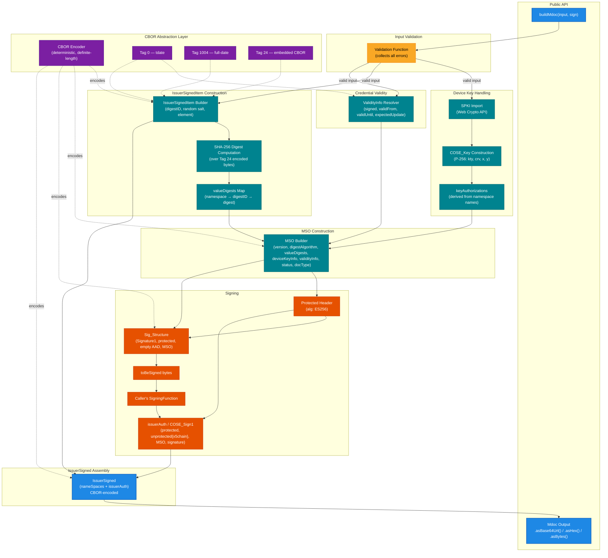

# Mobile Wallet mdoc Builder Documentation

## Component Architecture Diagram

This diagram shows the internal architecture of the mdoc builder library. It maps the components that make up the library, how data flows between them, and how the CBOR abstraction layer underpins encoding
across the system. The public API surface is `buildMdoc`, which orchestrates all internal components to produce a signed mdoc credential.

## Legend

| Colour | Layer                  |
| ------ | ---------------------- |
| Blue   | Public API             |
| Yellow | Input Validation       |
| Teal   | Core Domain Logic      |
| Orange | Signing Pipeline       |
| Purple | CBOR Abstraction Layer |

## Component Summary

| Component                            | Responsibility                                                                      |
| ------------------------------------ | ----------------------------------------------------------------------------------- |
| **buildMdoc**                        | Public entry point — orchestrates all internal components                           |
| **Input Validation**                 | Validates `MdocBuilderInput`, collects all errors before returning                  |
| **Device Key Handling**              | Imports SPKI key via Web Crypto, builds COSE_Key (P-256), derives keyAuthorizations |
| **Credential Validity**              | Resolves `signed`, `validFrom`, `validUntil`, `expectedUpdate` at construction time |
| **IssuerSignedItem Construction**    | Wraps each data element with digestID + random salt, computes SHA-256 digests       |
| **MSO Construction**                 | Assembles the Mobile Security Object with all metadata and digests                  |
| **Protected Header & Sig_Structure** | Builds COSE Sig_Structure to produce `toBeSigned` bytes                             |
| **Signing Callback**                 | Passes `toBeSigned` to caller's function, assembles COSE_Sign1 (issuerAuth)         |
| **IssuerSigned Assembly**            | Combines encoded namespace items + issuerAuth into final CBOR payload               |
| **Mdoc Output**                      | Wraps raw bytes, exposes `.asBase64Url()`, `.asHex()`, `.asBytes()`                 |
| **CBOR Abstraction Layer**           | Deterministic encoding, Tag 0/1004/24 support — isolates cbor2 dependency           |
