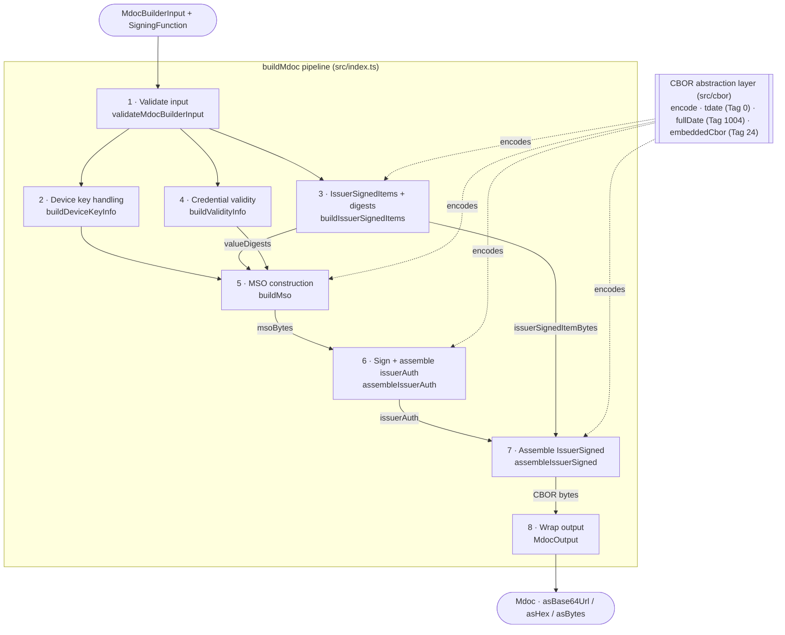

# Mobile Wallet mdoc Builder Component Architecture Diagram

This diagram shows the internal architecture of the mdoc builder library: the components that make up
the library, the order in which `buildMdoc` composes them, and how the CBOR abstraction layer underpins
encoding across the system. `buildMdoc(input, sign)` is the only public entry point; it orchestrates all
internal components in sequence to produce a signed mdoc credential.

The flow below reads top to bottom in the exact order `buildMdoc` runs (see `src/index.ts`).

`assembleIssuerAuth` is itself composed of smaller internal steps (`src/issuerAuth/`): it builds the
COSE protected header (`alg: ES256`), the unprotected header carrying `x5chain` (from
`certificateChain[0]`), and the `Sig_Structure` `toBeSigned` bytes; calls the caller's `SigningFunction`
with `toBeSigned`; validates the returned signature (a 64-byte P-256 `r||s` `Uint8Array`); and returns
`issuerAuth` as a `[protectedHeader, unprotectedHeader, msoBytes, signature]` structure — not
CBOR-encoded. Final CBOR encoding happens in `assembleIssuerSigned`.

## Component Summary

| Step | Component                  | Function                   | Responsibility                                                                      |
| ---- | -------------------------- | -------------------------- | ----------------------------------------------------------------------------------- |
| —    | **buildMdoc**              | `buildMdoc`                | Public entry point — orchestrates all internal components in order                  |
| 1    | **Input Validation**       | `validateMdocBuilderInput` | Validates `MdocBuilderInput`, collecting all errors; `buildMdoc` throws on any      |
| 2    | **Device Key Handling**    | `buildDeviceKeyInfo`       | Imports SPKI key via Web Crypto, builds COSE_Key (P-256), derives keyAuthorizations |
| 3    | **IssuerSignedItems**      | `buildIssuerSignedItems`   | Wraps each element with digestID + random salt; computes SHA-256 valueDigests       |
| 4    | **Credential Validity**    | `buildValidityInfo`        | Derives `signed`/`validFrom`; passes through `validUntil`/`expectedUpdate`          |
| 5    | **MSO Construction**       | `buildMso`                 | Assembles the Mobile Security Object and CBOR-encodes it to `msoBytes`              |
| 6    | **Sign + issuerAuth**      | `assembleIssuerAuth`       | Builds headers + `toBeSigned`, calls the signer, assembles COSE_Sign1 (issuerAuth)  |
| 7    | **IssuerSigned Assembly**  | `assembleIssuerSigned`     | Combines encoded namespace items + issuerAuth into final CBOR payload               |
| 8    | **Mdoc Output**            | `MdocOutput`               | Wraps raw bytes; exposes `.asBase64Url()`, `.asHex()`, `.asBytes()`                 |
| —    | **CBOR Abstraction Layer** | `src/cbor`                 | Deterministic encoding, Tag 0/1004/24 support — isolates the `cbor2` dependency     |
